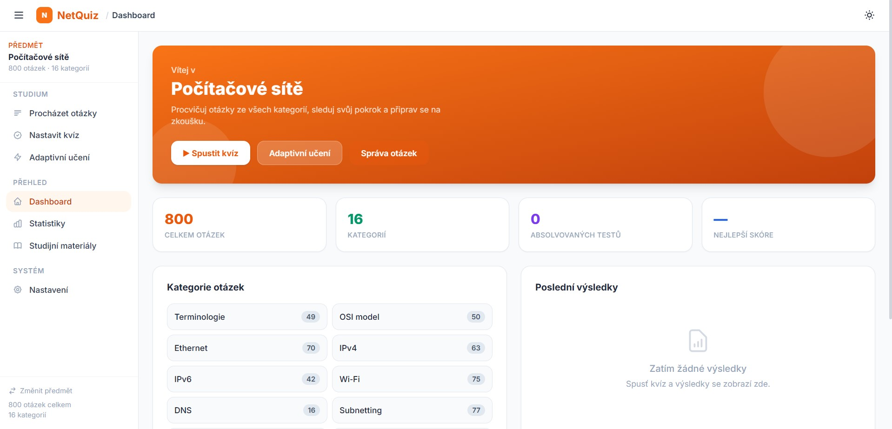
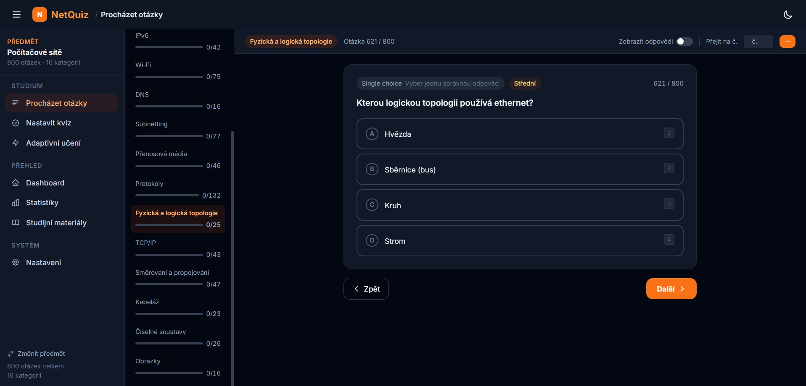

# NetQuiz

- Kvízová appka na opakování látky - aktuálně hlavně počítačové sítě, časem snad i webové technologie a další předměty.
- na fixy kdyžtak pište, nebo můžu dát collaboratora
---

## Důležité

- Otázky nemusí být vždy správně - část vznikla pomocí AI analýzy z prezentací
- Učitel může otázky kdykoliv změnit, přidat nebo odebrat
- Hodně otázek v appce má záměrně jasnou odpověď - jsou na naučení látky, ne na trénink zkoušky. Na přesnější simulaci zkoušky (1:1 odpovědi) je lepší projít tahak
- DNS učitel řadí do 5. (relační) vrstvy, i když správně patří do aplikační - u zkoušky napiš relační (Internet ti řekne, že patří do aplikační)
---

# Jak se připravit

## Počítačové sítě

### 1. Projít `FULL_TAHAK_2025.pdf`

Leaknuté otázky - ale nemusí být všechny správně nebo aktuální.

### 2. Projít všechny otázky v appce

Ideálně přes **Procházení**, ať si projdeš i otázky, které by se v testech mohly objevit.

### 3. Udělat pár zkušebních testů

U skutečné zkoušky je 25 otázek a 30 minut času

---

Na zkoušku je povolená tužka s papírem - na převody, adresy, ...

Kurz na Moodlu:  
- https://moodle.utb.cz/course/view.php?id=16491

Heslo (asi):
- site

---

## Webové technologie

**130 otázek** pokrývajících celou látku:

| Kategorie | Otázky |
|-----------|--------|
| HTTP | 33 |
| HTML | 8 |
| CSS | 15 |
| Bootstrap | 3 |
| JavaScript | 8 |
| JS Frameworky | 5 |
| PHP & OOP | 12 |
| Laravel & OOP | 46 |

---

# Spuštění

1. Nainstaluj Python  
   *(a při instalaci zaškrtni `Add Python to PATH`)*

2. Ve složce `net-quiz` spusť:

```py
start.py
```

3. Jestli se neotevřelo autmaticky, tak otevři:

```txt
http://localhost:8000/net-quiz/
```

---

# Nefunguje to?

Zkus:

- zkontrolovat, že běží server
```bash
python -m http.server 8000
```

- vymazat cache / otevřít anonymní okno
- použít:
```txt
http://127.0.0.1:8000
```

místo `localhost`

# Podpora

Pokud ti appka pomohla, můžeš poslat pár korun na podporu projektu xdd

```txt
2081256014/3030
```

# Ukázky

## Dashboard



## Procházet otázky


